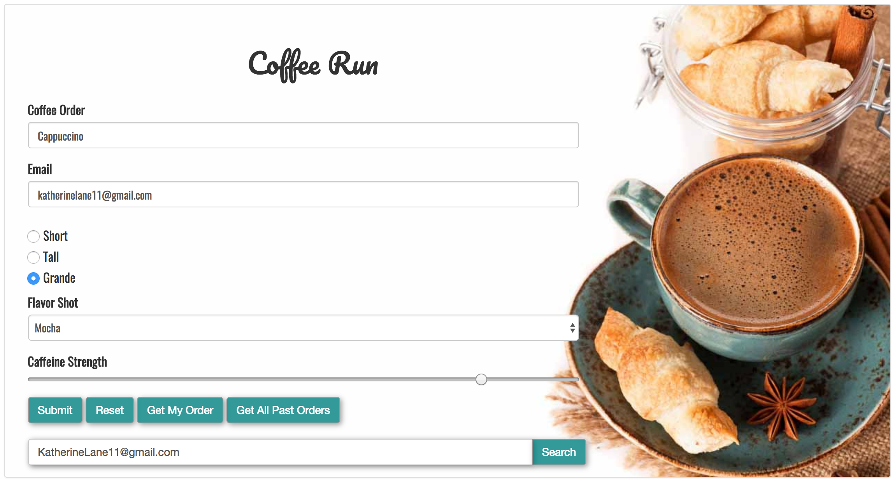
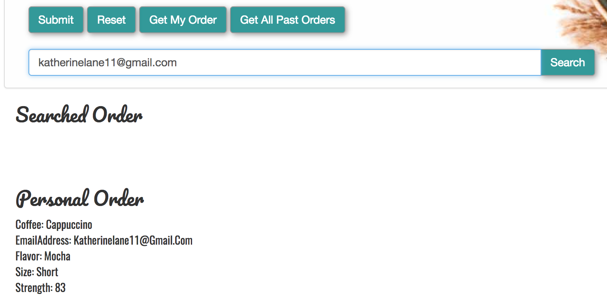

# CoffeeRun

DigitalCrafts: Learning LocalStorage


<b>Overall:</b>
- CoffeeRun's primary learning experience was working with localstorage and APIs.
- The first goal was to save to our personal localstorage.
- From there, I worked with an API that our instructor provided. 
- This created the ability to work with an API on a smaller scale and learn how obtain the necessary data.
- Styling was optional; however, personally, I enjoy going back and fourth from HTML and CSS to JavaScript, Ajax, and jQuery.


<b>Difficulties:</b>
- This project was my first incounter with APIs. Using another database with nested objects that I didn't personally create was interesting. Great learning experience to read through code and figure out how to extract the data needed.

<br />
<h3>Showcases the primary content of Coffee Run</h3>

<br />
<h3>Shows search rendering</h3>

<br />
<h3>Code snipit of jQuery used within Coffee Run to retreive data from our API in a JSON format</h3>

```javascript
// gets data from API in JSON format
function getDataFromAPI(){
    return $.getJSON(URL);
}
// callback: gets all data from API and then prints to DOM
function getOrdersFromAPI(){
    getDataFromAPI()
        .then(appendOrderToDOM);
};
// appends orders to DOM from API
function appendOrderToDOM(data){
    $.each(data, function(key, val){
        $(".past-order span")
            .append("Order: " + key + ": " + 
            "orders a " + val['coffee'] + " " + 
            checkForUndefined(val['size']) + " " + 
            checkForUndefined(val['flavor']) + " " + 
            setStrengthOfCoffee(val['strength']) + " " + "coffee." + " " + "<input id='chk_" + "'data-type='check-box' type='checkbox' value='" + true + "' />"  + "<br />" ); 
    });
};
// Delets order from API
function deleteOrderFromAPI(){
    var $checkBoxContainer = $("[data-type='check-box-container']");
    $checkBoxContainer.on('click', "input[type='checkbox']", function (){
        prompt("Would you like to delete this order?");
    });
};


// Code snipit of jQuery: searches item, then accounts for any blank values retreived from API
// --------------------------------
// when search container is filled out and search is click, this initializes</h5>
// gets data from API</h5>
// then searchs the API for particular email input by user</h5>
// then uses a counter so person can hide search bar</h5>
function searchForOrder(){
    $('[data-type-button="find-order"]').on('click', function () {
        event.preventDefault();
        getDataFromAPI()
            .then(searchAPI);
    });
};
// after getting data from API
// takes value submited in search area. 
// creates a blank object so can sort through specific data associated with email address
// if email is found within data...
// order will be set to data[$email] / this enables the ability to print different key values of data[$email] object
// if the email has been found, the order will be appended to the DOM
// if email was NOT found, user will recieve error 
function searchAPI(data){
    emptyText($(".searched-order span"));
    var $email = $('.email-search').val();
    var order = {};
    if (data[$email]){
        order = data[$email];
        $(".searched-order span")
            .append($email + ": " + 
            checkForUndefined(order.coffee) + " " + 
            checkForUndefined(order.size) + " " + 
            checkForUndefined(order.flavor) + " " + 
            setStrengthOfCoffee(order.strength)  + 
            " coffee." + "<br />");
    } else {
        $(".searched-order span").append("We do not have that email on file.");
    }
};
// emptys DOM in certain text fields so if button is clicked multiple times, the information is not printed over and over and over.
function emptyText(className){
    className.empty("");
}
```
